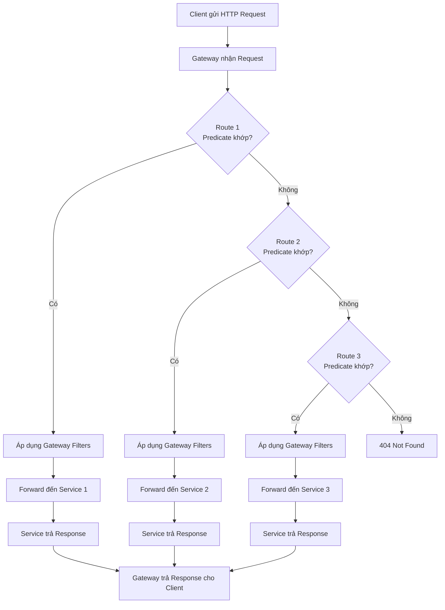
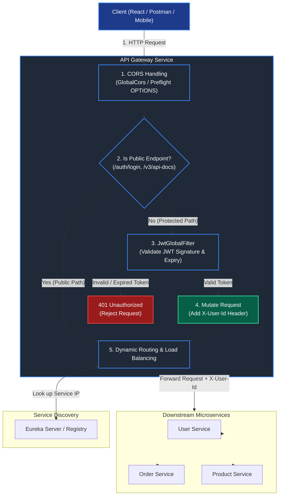

# Overview API Gateway

## 1. API Gateway Là Gì?

**API Gateway** là một thành phần phần mềm đóng vai trò như **cổng vào duy nhất** (single point of entry) đặt giữa các hệ thống phía client (Web UI, Mobile App, Third-party Services) và tập hợp các dịch vụ phía backend (đặc biệt là trong kiến trúc **Microservices**).

Thay vì Client phải gọi trực tiếp đến từng dịch vụ riêng lẻ, tất cả các request sẽ đi qua API Gateway. Tại đây, Gateway xử lý các tác vụ chung trước khi định tuyến request đến service phù hợp.

---

## 2. Các Chức Năng Chính Của API Gateway

- **Định tuyến Yêu cầu (Request Routing):** Nhận request từ Client và điều hướng chính xác đến Microservice tương ứng.
- **Xác thực & Phân quyền (Authentication & Authorization):** Kiểm tra JWT, OAuth token, API key ngay tại cửa ngõ trước khi cho phép request truy cập vào hệ thống nội bộ.
- **Giới hạn Lưu lượng (Rate Limiting & Throttling):** Kiểm soát số lượng request mà một Client có thể gửi trong một khoảng thời gian nhằm phòng chống tấn công DDoS và quá tải hệ thống.
- **Cân bằng Tải (Load Balancing):** Phân phối đều lượng truy cập đến các instance khác nhau của dịch vụ backend.
- **Chuyển đổi Giao thức (Protocol Translation):** Có thể chuyển đổi các giao thức từ phía ngoài (như HTTP/REST, WebSocket) sang giao thức nội bộ (như gRPC, AMQP).
- **Ghi log & Giám sát (Logging & Monitoring):** Tập trung thu thập dữ liệu về lượng truy cập, thời gian phản hồi (latency), và lỗi hệ thống tại một vị trí duy nhất.

---

## 3. Lợi Ích Của Việc Sử Dụng API Gateway

| Lợi ích                      | Chi tiết                                                                                                            |
| :--------------------------- | :------------------------------------------------------------------------------------------------------------------ |
| **Đơn giản hóa phía Client** | Client chỉ cần biết duy nhất một URL endpoint thay vì hàng chục endpoint của các microservices.                     |
| **Tăng cường Bảo mật**       | Giấu đi cấu trúc hạ tầng nội bộ, giảm nguy cơ tấn công trực tiếp vào backend.                                       |
| **Giảm Code lặp lại**        | Các logic dùng chung (Auth, Rate Limit, Logging) được xử lý tại Gateway thay vì triển khai lại ở từng microservice. |
| **Tối ưu hóa Phản hồi**      | Có thể tổng hợp dữ liệu (Request Aggregation) từ nhiều dịch vụ thành một response duy nhất cho Client.              |

---

## 4. Kiến thức

### 4.1. Predicate Router

Route Predicate là điều kiện để Gateway quyết định một request có được route (chuyển tiếp) đến service nào hay không.

**Path Predicate** : dùng để kiểm tra đường dẫn (URL path) của request có khớp với điều kiện hay không.

**Method Predicate** : dùng để kiểm tra HTTP Method của request (GET, POST, PUT, DELETE, PATCH...) trước khi quyết định có route request đó hay không.

**Header Predicate** : dùng để kiểm tra giá trị của HTTP Header trước khi quyết định có route request hay không.

**Query Predicate** : dùng để kiểm tra Query Parameter của URL trước khi quyết định có route request hay không.

**Host Predicate** : dùng để kiểm tra Host (domain) của request trước khi quyết định có route request hay không.

---

### 4.2. Rewrite Path

dùng khi cần thay đổi cấu trúc URL hoặc xử lý các trường hợp phức tạp bằng Regex.

- **Vd**: muốn match là **api/user** thì sẽ chuyển qua **User Service**. Tuy nhiên thực tế bên **User Service** path **/user** không có prefix là **/api** api chỉ là path được thêm bên **Gateway service**. Sẽ dùng rewrite để chỉnh lại path lúc call api bên service

**StripPrefix** là 1 dạng **Rewrite Prefix** dùng khi chỉ cần cắt bỏ một số segment đầu của URL, đơn giản và rất phổ biến.

---

### 4.3. Gateway Filter

Gateway Filter là thành phần của Spring Cloud Gateway dùng để xử lý request trước khi gửi đến service và/hoặc xử lý response trước khi trả về client.

Nếu ví Gateway là người gác cổng, thì:

- Predicate quyết định: "Cho request này đi qua cổng không?"
- Filter quyết định: "Sau khi được đi qua cổng thì sẽ xử lý request/response như thế nào?"

**Log Request** : là việc ghi lại thông tin của request khi nó đi qua Gateway hoặc Service.

**Log Response** : là việc ghi lại thông tin của response sau khi service xử lý xong và trước khi Gateway trả kết quả về cho client.

- **Log Request** = ghi lúc request đi vào Gateway.
- **Log Response** = ghi lúc response đi ra khỏi Gateway.

**Add Header** là mộtGateway Filter dùng để thêm Header vào Request hoặc Response.

Có hai loại phổ biến:

1. **AddRequestHeader** → Thêm Header vào Request trước khi gửi đến Service.
2. **AddResponseHeader** → Thêm Header vào Response trước khi trả về Client.

**Remove Header** là một Gateway Filter dùng để xóa Header khỏi Request hoặc Response.

Giống với AddHeader, có hai loại:

1. **RemoveRequestHeader** → Xóa Header khỏi Request trước khi gửi đến Service.
2. **RemoveResponseHeader** → Xóa Header khỏi Response trước khi trả về Client.

**Global Filter** là Filter được áp dụng cho tất cả các request đi qua Spring Cloud Gateway, không phụ thuộc vào route nào.

Nếu:

- Gateway Filter → chỉ áp dụng cho một Route.
- Global Filter → áp dụng cho mọi Route.

## 4. Sơ đồ kiến trúc

